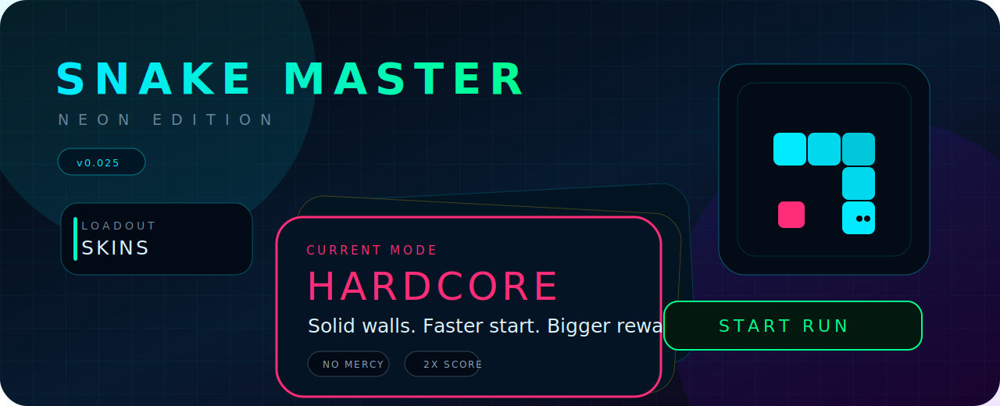
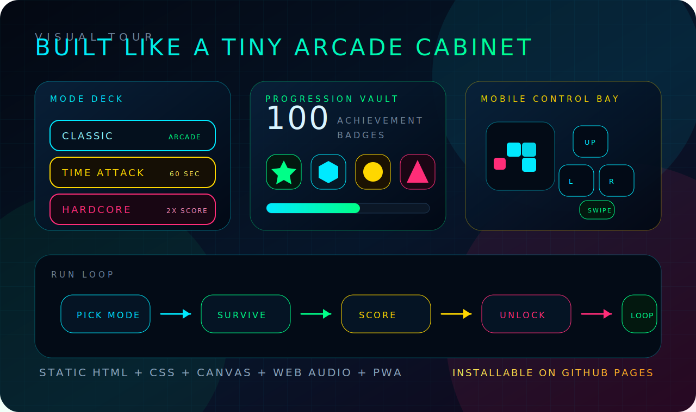

<p align="center">
  
</p>

<h1 align="center">Snake Master — Neon Edition</h1>

<p align="center">
  <strong>A neon arcade Snake game with cyber modes, unlockable skins, 100 achievements, mobile controls, and PWA polish.</strong>
</p>

<p align="center">
  <a href="https://manojrautaray.github.io/Snake-Master/">
    
  </a>
  
  
  
</p>

<p align="center">
  
  
  
  
  
</p>

---

<h2 align="center">What Is Snake Master?</h2>

<p align="center">
  Snake Master is a fast neon browser Snake game where you guide a glowing snake, collect food, grow longer, and chase high scores across Classic, Time Attack, and Hardcore modes. It keeps the original arcade loop simple, then adds skins, stats, achievements, mobile controls, and installable PWA support.
</p>

---

<p align="center">
  
</p>

---

## Arcade Snapshot

<table>
  <tr>
    <td width="25%">
      <h3>Mode Deck</h3>
      <p>Swipeable cyber card stack with side arrows and direct card selection.</p>
    </td>
    <td width="25%">
      <h3>Run Feel</h3>
      <p>Canvas glow, particles, screen shake, generated audio, and quick arcade pacing.</p>
    </td>
    <td width="25%">
      <h3>Progression</h3>
      <p>Persistent stats, 6 skins, mode bests, and 100 premium achievement badges.</p>
    </td>
    <td width="25%">
      <h3>Mobile PWA</h3>
      <p>Add to Home Screen, notch-safe layout, swipe deck, and large keypad controls.</p>
    </td>
  </tr>
</table>

---

## Mode Lineup

| Mode | Accent | Personality | Rules |
|---|---:|---|---|
| **Classic** | `#00eaff` | Pure arcade flow | Wrap walls, standard score, steady growth |
| **Time Attack** | `#ffd700` | Fast sprint | 60-second timer and boosted score payouts |
| **Hardcore** | `#ff2d78` | No mercy | Solid walls, faster start, higher reward |

The selected mode also themes the Start button, so the home screen always makes the active choice obvious.

---

## Progression Vault

<table>
  <tr>
    <td width="50%">
      <h3>Skins</h3>
      <p><strong>Cyber</strong> default</p>
      <p><strong>Venom</strong> score 500</p>
      <p><strong>Plasma</strong> score 1500</p>
      <p><strong>Gold Rush</strong> 1.5 km distance</p>
      <p><strong>Shadow</strong> score 3000</p>
      <p><strong>Inferno</strong> 5 km distance</p>
    </td>
    <td width="50%">
      <h3>Achievements</h3>
      <p>
        
        
        
        
      </p>
      <p>Achievements are shown as scrollable badge cards with progress bars and a visual unlock state.</p>
    </td>
  </tr>
</table>

---

## Controls

| Where | What Works |
|---|---|
| Desktop | Arrow keys to steer, Space to start |
| Mobile Swipe | Swipe on the board or the full bottom control deck |
| Mobile Keypad | Large thumb-friendly direction buttons |
| Home Screen | Arrows, swipe, or direct mode card tap |

Mobile control preference is saved locally, so the game remembers whether the player prefers swipe or keypad.

---

## Built For GitHub Pages

<table>
  <tr>
    <td><strong>Static</strong><br>No backend, no framework, no build step.</td>
    <td><strong>Installable</strong><br>Manifest, icons, service worker, and app-like launch.</td>
  </tr>
  <tr>
    <td><strong>Mobile Safe</strong><br>iPhone notch and home-indicator spacing are handled.</td>
    <td><strong>Versioned</strong><br>Releases are tracked with lightweight git tags.</td>
  </tr>
</table>

---

## Tech Stack

<p>
  
  
  
  
  
</p>

```text
Snake-Master/
├── index.html
├── styles.css
├── manifest.webmanifest
├── service-worker.js
├── docs/
├── icons/
└── src/
    ├── config.js
    ├── main.js
    ├── core/
    ├── data/
    ├── render/
    ├── systems/
    ├── ui/
    └── utils/
```

## Local Play

```bash
git clone https://github.com/manojrautaray/Snake-Master.git
cd Snake-Master
python3 -m http.server 8000
```

Open `http://localhost:8000`.

## Release Flow

```bash
git push origin main
```

Small improvements use tags such as `v0.020`, `v0.021`, `v0.022`. Medium milestones can move through `v0.100`, `v0.200`, and major resets can use `v1.000`, `v2.000`.

## Roadmap

| Idea | Why It Could Be Fun |
|---|---|
| Daily Challenge | Gives players a reason to return |
| Share Score | Makes strong runs easy to brag about |
| More Themes | Lets skins evolve into full visual styles |
| Run Report Cards | Makes every game-over screen feel rewarding |
| Power-Up Experiments | Adds variety while preserving arcade tension |

## License

MIT. Play it, fork it, remix it, or use it as a learning project.
